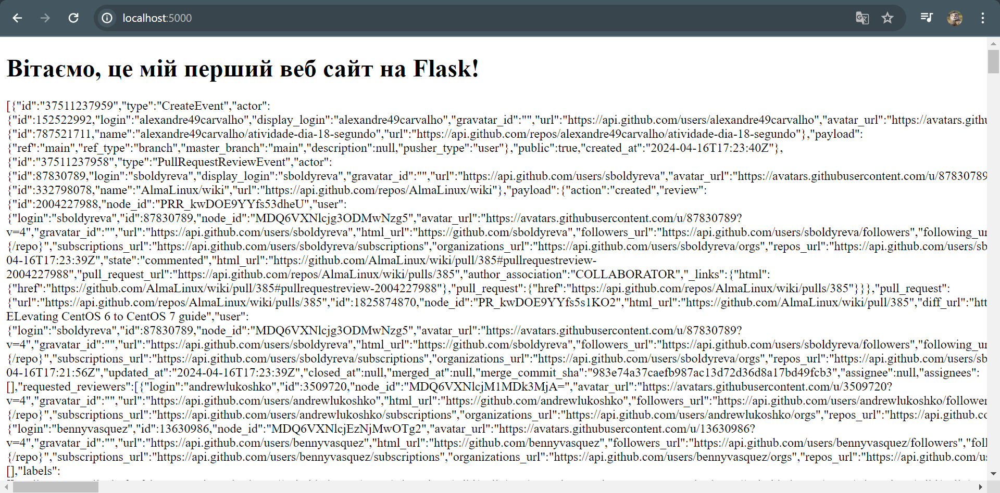

# Екзамен. Завдання #10
## Хід роботи:
1. Інсталював бібліотеку requests в віртуальне середовище

2. Дописав код в `app.py` так щоб при виклику головної сторінки index викликався метод requests.get. Результат:
